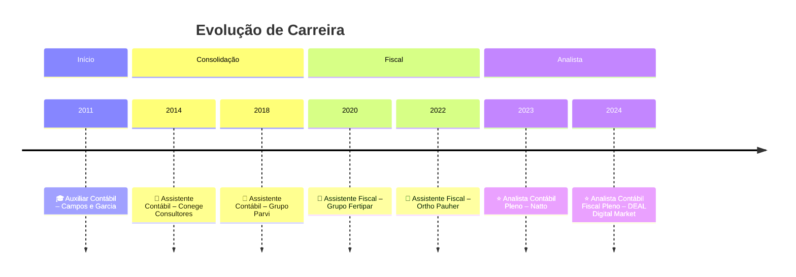
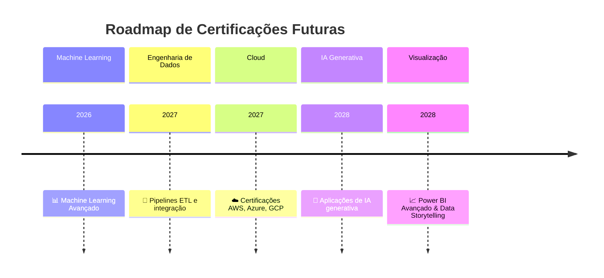

# 👩‍💻 **Barbara Freitas**  
## 📂 **Portfólio Profissional**

### ✨ Da contabilidade à ciência de dados: uma jornada analítica  

🎓 **Formada em Ciências Contábeis pela UFPE**  
📚 **Especialista em Direito Tributário e Aduaneiro pela PUC Minas**  
💼 **+10 anos de experiência nas áreas Contábil, Fiscal, Tributária e Departamento Pessoal**  
📊 **Graduanda em Ciência de Dados pela Estácio de Sá (2º semestre)**  
🚀 Em **transição de carreira para a área de Dados**, unindo minha bagagem contábil e tributária com novas competências em análise e tecnologia.  

---

## 🌟 Sobre mim  
Sou apaixonada por transformar **números em insights estratégicos**. Minha trajetória combina sólida experiência em contabilidade e tributação com uma nova jornada em **Big Data, Analytics e Ciência de Dados**.  
Acredito que dados são o futuro da tomada de decisão, e quero ser ponte entre o mundo financeiro/tributário e a inteligência analítica.  

---

## ✨ Missão & Valores  

- **Missão**: Usar dados para gerar valor estratégico, apoiar decisões inteligentes e promover inovação.  
- **Valores**:  
  - Ética e transparência na análise de informações  
  - Inovação contínua e aprendizado constante  
  - Impacto positivo nos negócios e na sociedade  
  - Colaboração e compartilhamento de conhecimento  

---

## 🛠️ Tecnologias & Ferramentas  

  
  
  
  
  
  

---

## 📜 Certificações  

  
  
  

---

### 🎯 Certificações em Destaque  

- **FIAP – Big Data & Analytics (60h)**  
- **FIAP – Gestão Financeira de Empresas (20h)**  
- **DIO – Data Science & Python**  
- **DIO – Cloud & AI Essentials**  
- **LinkedIn Learning – Business Intelligence & Analytics**  

---

## 🚀 Projetos em Destaque  
- **Fraudshield AI 2.0** – 🔍 Detecção de fraudes financeiras com IA
- **BIA Academy Finance** – 💡 Educadora financeira inclusiva com IA local
- **VoxAI DIO** – 🎙️ Assistente de voz com NLP  
- **Miniguia SFN Investimentos** – 📘 Guia prático sobre o Sistema Financeiro Nacional  

 
---

## 💼 Experiência Profissional  

### 📊 Resumo em Tabela  

| 🏷️ Cargo                        | 🏢 Empresa             | 📅 Período     | 🔑 Competências-Chave |
|---------------------------------|-----------------------|----------------|-----------------------|
| ⭐ Analista Contábil Fiscal Pleno | DEAL Digital Market   | 2024–2025      | Conciliação, Análise Contábil, Apuração IRPJ/CSLL, Obrigações Acessórias ERP Sankhya |
| ⭐ Analista Contábil Pleno        | Natto                 | 2023           | ICMS/Prodepe, Conciliação,Análise Contábil, ERP Sankhya |
| 📌 Assistente Fiscal              | Ortho Pauher          | 2022–2023      | Escrituração Fiscal, Retenção de Impostos, ERP Protheus-Totvs |
| 📌 Assistente Fiscal              | Grupo Fertipar        | 2020–2022      | Escrituração Fiscal, Cadastro Fornecedores, Apuração Municipal, ERP Protheus-Totvs|
| 📌 Assistente Contábil            | Grupo Parvi           | 2018–2020      | Conciliação, Analise Contábil,PIS/COFINS,ERP Dealernet|
| 📌 Assistente Contábil            | Conege Consultores    | 2014–2017      | Escrituração Contábil-Fiscal, Folha, ERP Domínio |
| 🎓 Auxiliar Contábil              | Campos e Garcia       | 2011–2012      | Estágio, Escrituração Cont/abil|Fiscal| Depto Pessoal, Balancetes, Obrigações Acessórias |

---

### 🕰️ Linha do Tempo Visual  

## 🧭 Roadmap de Aprendizado  

- ✅ **Já dominando**: Contabilidade, Fiscal, DP, Excel Avançado, Power BI  
- 🚧 **Em progresso**: Python, SQL, Pandas, Estatística aplicada  
- 🌱 **Próximos passos**: Machine Learning, Cloud Computing, IA Generativa, Engenharia de Dados  

---

## 🕰️ Future Timeline – Próximas Certificações  

## 🌐 Conecte-se comigo  
- **LinkedIn**: [Barbara Freitas](https://www.linkedin.com/in/barbarafreitas-dataanalytics)  
- **GitHub**: [BARBARANFS](https://github.com/BARBARANFS)  
  
