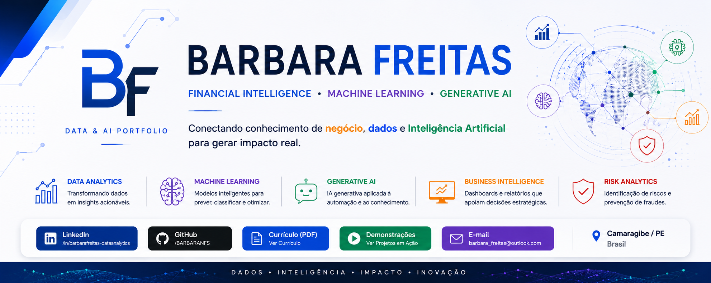
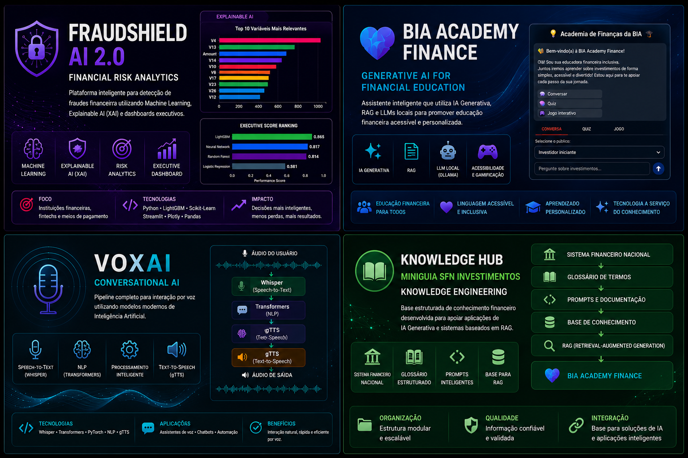

<p align="center">
  
</p>


# 👋 Sobre Mim

Sou graduada em Ciências Contábeis, especialista em Direito Tributário e Aduaneiro e graduanda em Ciência de Dados. Ao longo de mais de 10 anos de atuação nas áreas Contábil, Departamento Pessoal, Fiscal, Tributária, Compliance e Incentivos Fiscais, desenvolvi uma sólida visão de negócio orientada à análise de dados, gestão de riscos e tomada de decisão.

Hoje uno essas experiências ao uso de Data Analytics, Machine Learning e Inteligência Artificial Generativa para desenvolver soluções que transformam dados em inteligência, apoiando decisões estratégicas, reduzindo riscos e gerando valor para organizações.

---
# 🌐 Ecossistema de Soluções

Este portfólio reúne um conjunto de projetos desenvolvidos de forma evolutiva, demonstrando aplicações práticas de Engenharia de Conhecimento, Inteligência Artificial Generativa, Processamento de Linguagem Natural, Machine Learning e Analytics.

Embora possam ser utilizados de forma independente, todos fazem parte de um mesmo ecossistema voltado à transformação de dados em inteligência para apoiar decisões, reduzir riscos e gerar valor para organizações.

<p align="center">
  
</p>

---

## 🚀 Evolução dos Projetos

| Etapa | Projeto | Objetivo |
|:------|:---------|:---------|
| 📘 **Knowledge Engineering** | **MiniGuia SFN Investimentos** | Base estruturada de conhecimento financeiro desenvolvida no NotebookLM para aplicações de IA Generativa e RAG. |
| 🎙️ **Conversational AI** | **VoxAI** | Pipeline de interação por voz utilizando Whisper, NLP, Transformers e síntese de voz. |
| 💙 **Generative AI** | **BIA Academy Finance** | Assistente inteligente para educação financeira utilizando RAG, LLM Local (Ollama) e IA Generativa. |
| 🛡️ **Machine Learning & Risk Analytics** | **FraudShield AI 2.0** | Plataforma de detecção de fraudes com Machine Learning, Explainable AI (XAI) e dashboards executivos. |

> **Conhecimento → Inteligência → Interação → Decisão**

---

## 🔗 Como os projetos se conectam

Os quatro projetos representam uma evolução contínua de competências em Ciência de Dados e Inteligência Artificial.

```text
MiniGuia SFN Investimentos
        │
        ▼
Knowledge Engineering
        │
        ▼
VoxAI
        │
Conversational AI
        │
        ▼
BIA Academy Finance
        │
Generative AI • RAG • LLM Local
        │
        ▼
FraudShield AI 2.0
        │
Machine Learning • Explainable AI • Risk Analytics
        │
        ▼
Business Intelligence
Tomada de Decisão
```

# 🧩 Como transformo dados em valor

```text
            Problema de Negócio
                     │
                     ▼
      Entendimento do Contexto
                     │
                     ▼
      Coleta e Preparação de Dados
                     │
                     ▼
        Análise Exploratória (EDA)
                     │
                     ▼
 Machine Learning / Inteligência Artificial
                     │
                     ▼
      Explainable AI (Interpretabilidade)
                     │
                     ▼
 Dashboards • Indicadores • Automação
                     │
                     ▼
      Apoio à Tomada de Decisão
```

# 🛠️ Competências & Tecnologias

Mais do que apresentar tecnologias, este portfólio evidencia a aplicação prática de **Ciência de Dados, Inteligência Artificial e conhecimento de negócio** na resolução de problemas reais, conectando análise de dados, desenvolvimento de modelos e geração de valor para organizações.

<div align="center">

| 📊 **Data Analytics** | 🤖 **Artificial Intelligence** | 💼 **Business & Financial Intelligence** |
|:---:|:---:|:---:|
| 🐍 Python | 🧠 Machine Learning | 💰 Financial Analytics |
| 🗄️ SQL | ✨ Generative AI | 🛡️ Risk Analytics |
| 🐼 Pandas & NumPy | 🔍 Explainable AI (XAI) | ⚖️ Compliance |
| 📈 EDA & Data Visualization | 📚 RAG & Prompt Engineering | 📊 Business Intelligence |
| 📖 Storytelling com Dados | 💬 NLP • LLMs • Ollama | 🏛️ Governança & Tomada de Decisão |

</div>

<br>

<div align="center">

| 🎯 **O que entrego através dessas competências** |
|:---|
| ✔ Soluções orientadas por dados para problemas de negócio |
| ✔ Modelos de Machine Learning interpretáveis e aplicáveis |
| ✔ Dashboards executivos para apoio à decisão |
| ✔ Aplicações com IA Generativa e Engenharia de Prompt |
| ✔ Automação de processos analíticos |
| ✔ Soluções para Gestão de Riscos e Educação Financeira |

</div>

# 📈 Evolução Profissional

Minha trajetória profissional começou na área de negócios, evoluindo para Ciência de Dados e Inteligência Artificial. Essa combinação entre conhecimento financeiro, análise de dados e tecnologia orienta o desenvolvimento das soluções apresentadas neste portfólio.

```text
CONTABILIDADE
      │
      ▼
FISCAL • TRIBUTÁRIO
      │
      ▼
COMPLIANCE • GOVERNANÇA
      │
      ▼
BUSINESS ANALYTICS
      │
      ▼
CIÊNCIA DE DADOS
      │
      ▼
MACHINE LEARNING
      │
      ▼
GENERATIVE AI
      │
      ▼
FINANCIAL INTELLIGENCE
```


#  💎 Diferencial Profissional

Minha trajetória começou pelo negócio e evoluiu para a tecnologia. Antes de construir modelos, aprendi a compreender processos financeiros, tributários e de compliance. Hoje aplico Ciência de Dados e Inteligência Artificial para resolver esses desafios de forma orientada por dados.

---

# 🎓 Formação Acadêmica

| Formação                                            | Instituição                               |
| --------------------------------------------------- | ----------------------------------------- |
| 🎓 Bacharelado em Ciências Contábeis                | Universidade Federal de Pernambuco (UFPE) |
| 🎓 Especialização em Direito Tributário e Aduaneiro | PUC Minas                                 |
| 🎓 Ciência de Dados *(em andamento)*                | Universidade Estácio de Sá                |

---

# 📚 Formação Complementar

<div align="center">

| Python | Data Science | IA Generativa | Cloud & Dev |
|:------:|:-----------:|:------------:|:------:|
| Programação | Machine Learning | Prompt Engineering | Git |
| POO | Estatística | Azure AI | GitHub |
| Estruturas de Dados | Visualização | Copilot | APIs |

</div>

> **Formação complementar desenvolvida por meio de trilhas práticas na Digital Innovation One (DIO) e FIAP, com foco em Ciência de Dados, Inteligência Artificial e Desenvolvimento.**


# 📊 GitHub em Números

<div align="center">

<!-- Substitua "BARBARANFS" caso altere seu usuário -->


</div>

<br>

<div align="center">


</div>

---

# 💡 Minha Filosofia

> **Dados contam histórias.**
>
> **Modelos identificam padrões.**
>
> **Inteligência Artificial amplia possibilidades.**
>
> **Mas o verdadeiro impacto acontece quando tecnologia e conhecimento de negócio trabalham juntos para resolver problemas reais.**
>
> É nessa interseção entre pessoas, dados e estratégia que construo minha carreira.

---

# 🤝 Vamos conversar?

Estou sempre aberta a oportunidades, colaborações e desafios que envolvam dados, Inteligência Artificial e inovação.

<div align="center">

<a href="https://github.com/BARBARANFS" target="_blank">

</a>

<a href="https://www.linkedin.com/in/barbarafreitas-dataanalytics" target="_blank">

</a>

</div>

---

<div align="center">

## ⭐ Obrigada pela visita!

### "Transformando conhecimento de negócio em soluções inteligentes através de Dados e Inteligência Artificial."

<br>

**Barbara Freitas**

*Data Analytics • Machine Learning • Generative AI • Financial Intelligence*

</div>

---


